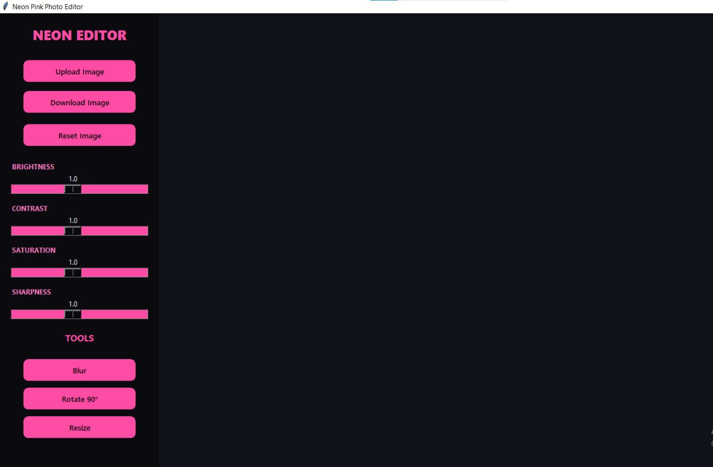

# Neon Pink Photo Editor

A desktop photo editing application built with Python, Tkinter, and Pillow. The application provides essential image enhancement and manipulation features through a modern graphical user interface.

## Features

* Upload JPG, JPEG, and PNG images
* Adjust image brightness
* Adjust image contrast
* Modify image saturation
* Control image sharpness
* Apply Gaussian blur
* Rotate images by 90 degrees
* Resize images
* Reset edits to the original image
* Save edited images

## Screenshot



## Tech Stack

* Python
* Tkinter
* Pillow (PIL)

## Project Structure

```text
neon-photo-editor/
│
├── main.py
├── requirements.txt
├── .gitignore
├── LICENSE
├── README.md
└── screenshots/
    └── editor.png
```

## Installation

### Clone the Repository

```bash
git clone https://github.com/your-username/neon-photo-editor.git
cd neon-photo-editor
```

### Create and Activate a Virtual Environment

Windows:

```bash
python -m venv venv
venv\Scripts\activate
```

Linux/macOS:

```bash
python -m venv venv
source venv/bin/activate
```

### Install Dependencies

```bash
pip install -r requirements.txt
```

## Requirements

* Python 3.10+
* Pillow

## Run the Application

```bash
python main.py
```

## Supported Formats

### Input

* JPG
* JPEG
* PNG

### Output

* JPG
* PNG

## Future Improvements

* Crop tool
* Flip image horizontally and vertically
* Undo and redo functionality
* Additional image filters
* Drag and drop image upload
* Histogram analysis
* Export quality settings

## License

This project is licensed under the MIT License. See the LICENSE file for details.

## Author

Rishav Mandal
